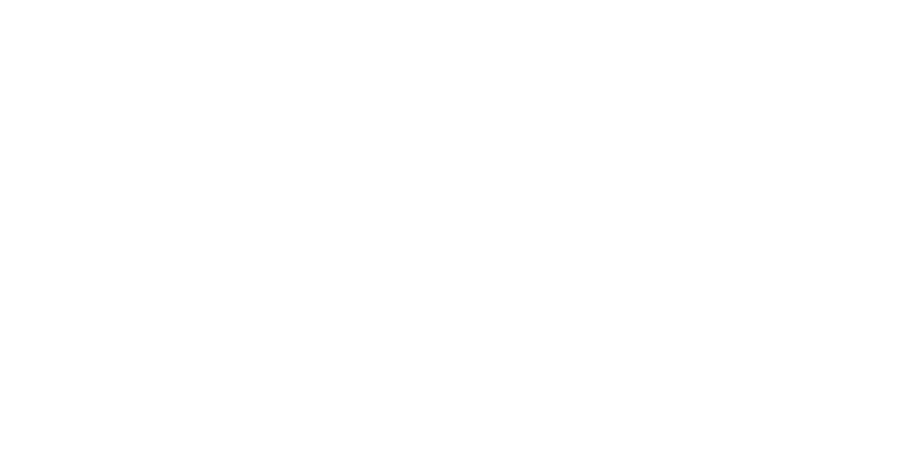

# 🧠 Mem0 Client

A specialized AI memory management tool for **chat conversation archival and retrieval**. Designed to batch import chat histories, short documents, and provide time-based memory search through both CLI and web interfaces.

## ✨ Features

- **🌐 Web Interface**: User-friendly Streamlit web application with advanced settings
- **⚡ CLI Tool**: Command-line interface for automation and scripting
- **📂 Batch Processing**: Upload multiple files with concurrent processing and retry logic
- **🎯 Smart Processing**: Custom instructions, content filtering, and AI-powered memory extraction
- **💾 Persistent Settings**: Save your preferences to configuration files
- **🔍 Advanced Search**: Semantic search, time-based filtering, and content analysis
- **📊 Analytics**: Weekly reports and memory statistics

## 📸 Interface Preview



*Clean and intuitive web interface with tabbed navigation, sidebar settings, and comprehensive search capabilities.*

## ⚠️ Important Usage Notes

### 🧠 How Mem0 Memory Works

**Mem0's memory system is optimized for real-time conversation flow**, not bulk historical data processing. Understanding this is crucial for effective usage:

#### ✅ Best Use Cases
- **Short text snippets** (documents, notes, summaries)
- **Individual chat conversations** (exported as JSON)
- **Incremental batch processing** of chat histories
- **Real-time memory updates** during active conversations

#### ❌ Limitations
- **Large chat histories**: When uploading 50+ message conversations at once, Mem0 typically only processes the **last 2-3 messages** effectively
- **Bulk historical dumps**: Massive conversation exports lose context and memory quality degrades significantly

#### 🎯 Recommended Workflow
1. **Export conversations** using tools like [Echoes Chrome Extension](https://chromewebstore.google.com/detail/echoes-chatgpt-claude-gem/ppnfnillfndkellpbphafglnljdefjph?hl=en-US)
2. **Process conversations individually** - one JSON file per conversation session
3. **Use incremental batch processing** - simulate real-time chat by processing messages in smaller chunks
4. **Query by time ranges** - search memories within specific date periods for better organization
5. **Generate manual reports** - use search results to create custom weekly/monthly summaries

This tool is specifically designed for **chat conversation archival and retrieval**, not as a replacement for real-time memory integration.

## 🚀 Quick Start

### Prerequisites

- Python 3.8 or higher
- Mem0 API key (get one at [mem0.ai](https://mem0.ai))

### Installation

1. **Clone the repository**
   ```bash
   git clone <repository-url>
   cd mem0Client
   ```

2. **Install dependencies**
   ```bash
   pip install -r requirements.txt
   ```

3. **Set up environment variables**
   
   Copy the example environment file:
   ```bash
   cp env_example.txt .env
   ```
   
   Edit `.env` and add your Mem0 API key:
   ```bash
   MEM0_API_KEY=your_mem0_api_key_here
   DEFAULT_USER_ID=your_user_id  # Optional
   ```

4. **Configure settings (Optional)**
   
   Customize `config.yaml` for your preferences:
   ```yaml
   # Advanced processing settings (persistent)
   advanced_settings:
     custom_instructions: "Extract key insights and technical details"
     includes: "documentation, tutorials, code examples"
     excludes: "personal information, temporary notes"
     exclude_presets: ["Personal Names", "Contact Info"]
     infer: true
   
   # File processing
   file_processing:
     concurrent_upload: true
     max_concurrent_files: 3
   ```

## 🌐 Web Interface

### Launch the Web App

```bash
streamlit run web_app.py
```

The web interface will open in your browser at `http://localhost:8501`

### Web Interface Features

- **📤 Upload Tab**: Upload text, single files, or batch files
- **🔍 Search Tab**: Semantic search through your memories
- **📅 Time Search**: Filter memories by date ranges
- **📊 Weekly Report**: Generate activity summaries

### Sidebar Settings

Configure processing options in the left sidebar:

- **Custom Instructions**: Guide AI on how to process content
- **Includes/Excludes**: Filter content types
- **Privacy Presets**: Common exclusion options
- **Infer Memories**: Toggle AI processing vs raw storage
- **💾 Save Settings**: Persist preferences to config file

### Batch File Upload

1. Go to **Upload → Batch Files**
2. Select multiple files (.md, .txt, .json, .markdown)
3. Choose processing mode:
   - **Concurrent**: Faster parallel processing (recommended for multiple short files)
   - **Sequential**: Safer one-by-one processing (recommended for large JSON chat files)
4. Upload with automatic retry and detailed results

> **💡 Pro Tip**: For large chat conversation JSON files, use **Sequential mode** to ensure proper incremental processing that simulates real-time chat flow.

## 💻 CLI Usage

### Basic Commands

```bash
# Check configuration
python cli.py config-check

# Upload text with default settings
python cli.py upload-text "Your content here" --use-defaults

# Upload a single file
python cli.py upload-file document.md --custom-instructions "Extract technical details"

# Batch upload directory
python cli.py upload-directory /path/to/files --concurrent --use-defaults

# Search memories
python cli.py search "artificial intelligence" --limit 10

# Time-based search
python cli.py search-time --days 7 --query "project updates"

# Generate weekly report
python cli.py weekly-report --weeks-back 1
```

### Advanced CLI Options

```bash
# Override persistent settings
python cli.py upload-file file.md \
  --custom-instructions "Focus on architecture details" \
  --includes "code, diagrams, specifications" \
  --excludes "personal notes, draft content" \
  --infer

# Batch directory upload with custom settings
python cli.py upload-directory /docs \
  --concurrent \
  --custom-instructions "Extract documentation insights" \
  --recursive
```

## 📁 Project Structure

```
mem0Client/
├── cli.py                    # Command-line interface
├── web_app.py               # Streamlit web application
├── config.yaml              # Configuration with persistent settings
├── core/
│   ├── config.py            # Configuration management
│   ├── parser.py            # Content parsing
│   ├── uploader.py          # Upload with batch processing
│   ├── searcher.py          # Search functionality
│   ├── utils.py             # Common utilities
│   └── web_helpers.py       # Web interface helpers
├── requirements.txt         # Python dependencies
└── env_example.txt          # Environment variables template
```

## ⚙️ Configuration

### Environment Variables

| Variable | Description | Required |
|----------|-------------|----------|
| `MEM0_API_KEY` | Your Mem0 API key | ✅ Yes |
| `DEFAULT_USER_ID` | Default user identifier | ❌ Optional |

### Configuration File

The `config.yaml` file contains:

- **Advanced Settings**: Persistent processing preferences
- **File Processing**: Upload behavior and supported formats
- **Search Settings**: Default limits and options
- **Debug Settings**: API logging configuration

### Persistent Settings

Settings configured in the web interface sidebar are automatically saved to `config.yaml` and can be used across sessions.

## 🔧 Troubleshooting

### Common Issues

1. **API Key Not Found**
   ```bash
   # Check if environment variable is set
   echo $MEM0_API_KEY  # Linux/Mac
   echo %MEM0_API_KEY% # Windows
   ```

2. **Batch Upload Failures**
   - Try sequential processing instead of concurrent
   - Check file formats are supported (.md, .txt, .json, .markdown)
   - Reduce `max_concurrent_files` in config

3. **Search Returns No Results**
   - Verify user_id matches uploaded content
   - Check date formats for time-based searches
   - Enable debug logging in config.yaml

### Debug Mode

Enable detailed logging in `config.yaml`:
```yaml
debug:
  enable_api_logging: true
```

## 📚 Supported File Formats

- **Markdown**: `.md`, `.markdown`
- **Text**: `.txt`
- **JSON**: `.json` (chat conversation format)

### JSON Chat Format
```json
{
  "id": "conversation-123",
  "title": "Chat with AI",
  "created": 1672531200000,
  "updated": 1672531200000,
  "messages": [
    {"role": "user", "content": "Hello"},
    {"role": "assistant", "content": "Hi there!"}
  ]
}
```

#### 🕐 Automatic Timestamp Support

**When uploading JSON chat files, the system automatically uses the `updated` timestamp from the file instead of the current time.** This means:

- **Historical Accuracy**: Your imported conversations maintain their original timestamps
- **Proper Chronology**: Memories are created with the actual conversation time, not the import time
- **Time-based Search**: You can search memories by their original conversation dates

The `updated` field in JSON files is automatically converted from milliseconds to Unix timestamp and passed to Mem0's timestamp API.

### 💡 Exporting Chat Conversations

For easy JSON export from AI chat platforms, we recommend using the **[Echoes Chrome Extension](https://chromewebstore.google.com/detail/echoes-chatgpt-claude-gem/ppnfnillfndkellpbphafglnljdefjph?hl=en-US)**. This powerful tool allows you to:

- **Export conversations** from ChatGPT, Claude, and Gemini to JSON format
- **Search and organize** your AI chat history across platforms
- **Bulk export** multiple conversations for batch processing
- **Privacy-focused** with local data processing

The exported JSON files from Echoes are fully compatible with this Mem0 Client and provide a seamless way to preserve and process your AI conversation history.

## 🤝 Contributing

1. Fork the repository
2. Create a feature branch
3. Make your changes
4. Test thoroughly
5. Submit a pull request

## 📄 License

This project is licensed under the MIT License - see the LICENSE file for details.

## 🔗 Links

- [Mem0 API Documentation](https://docs.mem0.ai/)
- [Streamlit Documentation](https://docs.streamlit.io/)

---

**Happy Memory Management! 🧠✨** 
